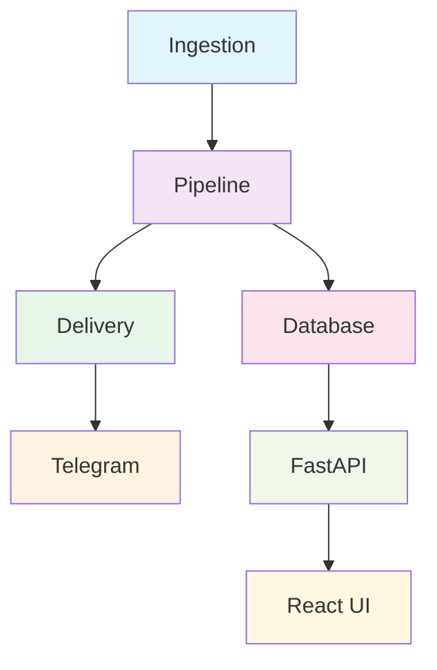

# AI News Broadcaster

A fully autonomous AI-powered news aggregation and broadcasting system that fetches articles from multiple sources, intelligently summarizes them using LLMs, converts summaries to audio, and delivers broadcasts to users via Telegram.

## Features

- **Multi-source ingestion**: Fetch news from RSS feeds, news APIs, and web scrapers
- **Intelligent filtering & summarization**: Use LLMs (OpenAI, Groq, Gemini) to filter relevant news and generate radio-anchor-style summaries
- **Text-to-speech**: Convert summaries to audio using ElevenLabs or EdgeTTS
- **Telegram delivery**: Send news digests and audio broadcasts directly to Telegram users
- **Automated scheduling**: Run the entire pipeline on a cron schedule or trigger manually
- **Web dashboard**: Monitor sources, articles, summaries, and broadcasts through a React frontend
- **Full REST API**: Complete FastAPI backend for programmatic access

## Technology Stack

### Backend
- **FastAPI** — Modern async Python web framework
- **SQLAlchemy + Alembic** — ORM and database migrations
- **Pydantic** — Data validation
- **APScheduler** — Job scheduling
- **OpenAI/Groq/Gemini** — LLM APIs for filtering and summarization
- **ElevenLabs/EdgeTTS** — Text-to-speech synthesis
- **Telegram Bot API** — Message delivery

### Frontend
- **React 18** — UI framework
- **Vite** — Build tool
- **TailwindCSS** — Styling
- **Axios** — API client
- **React Router** — Navigation

### Infrastructure
- **Docker** — Containerization
- **GitHub Actions** — CI/CD pipeline
- **SQLite** (dev) / PostgreSQL (prod) — Database

## Project Architecture



### Backend Architecture

The backend follows a modular architecture with clear separation of concerns:

- **Ingestion Layer**: Fetches news from various sources (RSS feeds, APIs)
- **Pipeline Layer**: Processes articles through filtering, summarization, and deduplication
- **Delivery Layer**: Converts summaries to audio and sends via Telegram
- **Database Layer**: Stores all application data using SQLAlchemy ORM
- **API Layer**: Exposes REST endpoints for frontend and external access

### Directory Structure

```
ai-news-broadcaster/
├── backend/                     # FastAPI application
│   ├── app/
│   │   ├── api/routes/         # API endpoints
│   │   ├── core/               # Config, logging, database
│   │   ├── models/             # SQLAlchemy models
│   │   ├── schemas/            # Pydantic schemas
│   │   └── main.py             # App entrypoint
│   ├── requirements.txt
│   └── tests/
├── frontend/                    # React UI
│   ├── src/
│   │   ├── components/         # Reusable UI components
│   │   ├── pages/              # Page-level components
│   │   ├── api/                # API client
│   │   └── main.jsx            # App entrypoint
│   ├── index.html
│   └── package.json
├── services/                    # Business logic modules
│   ├── ingestion/              # Data fetching
│   ├── pipeline/               # LLM processing
│   ├── audio/                  # Text-to-speech
│   ├── delivery/               # Telegram delivery
│   └── scheduling/             # Job scheduling
├── db/                          # Database models and migrations
│   ├── models/                 # SQLAlchemy models
│   ├── migrations/             # Alembic migrations
│   └── session.py              # Database session handling
├── .env.example                 # Environment variables example
├── .gitignore                   # Git ignore patterns
└── README.md                    # This file
```

## How to Run Locally

### Prerequisites
- Python 3.9+
- Node.js 16+
- Docker (optional, for containerized deployment)

### Backend Setup
1. Clone the repository
2. Create a virtual environment:
   ```bash
   python -m venv venv
   source venv/bin/activate  # On Windows: venv\Scripts\activate
   ```
3. Install dependencies:
   ```bash
   pip install -r backend/requirements.txt
   ```
4. Set up the database:
   ```bash
   cd db
   alembic upgrade head
   ```
5. Create a `.env` file from the example:
   ```bash
   cp .env.example .env
   ```
6. Run the FastAPI server:
   ```bash
   cd backend
   uvicorn app.main:app --reload
   ```

### Frontend Setup
1. Navigate to the frontend directory:
   ```bash
   cd frontend
   ```
2. Install dependencies:
   ```bash
   npm install
   ```
3. Run the development server:
   ```bash
   npm run dev
   ```

## Configuration

The application uses environment variables for configuration. Create a `.env` file with the following variables:

```env
# Database
DATABASE_URL=sqlite:///./db.sqlite3

# API Settings
PROJECT_NAME=AI News Broadcaster
VERSION=1.0.0
API_V1_STR=/api/v1

# LLM Settings
OPENAI_API_KEY=your_openai_key
GROQ_API_KEY=your_groq_key
GEMINI_API_KEY=your_gemini_key

# Telegram Settings
TELEGRAM_BOT_TOKEN=your_telegram_bot_token
TELEGRAM_CHAT_ID=your_chat_id

# Scheduler Settings
SCHEDULE_TIME=09:00
```

## Future Enhancements

- [ ] User preference settings (topics to include/exclude)
- [ ] Historical archive + search functionality
- [ ] Multiple delivery channels (email, Discord)
- [ ] Analytics on which stories get read
- [ ] Improved LLM model selection and management
- [ ] Enhanced UI with more interactive features
- [ ] Support for additional news sources
- [ ] Advanced filtering based on user preferences
- [ ] Integration with more TTS services

## Contribution Guidelines

We welcome contributions to the AI News Broadcaster project! Here are some guidelines:

1. Fork the repository
2. Create a feature branch (`git checkout -b feature/AmazingFeature`)
3. Commit your changes (`git commit -m 'Add some AmazingFeature'`)
4. Push to the branch (`git push origin feature/AmazingFeature`)
5. Open a Pull Request

### Code Style
- Follow PEP 8 for Python code
- Use TypeScript for React components
- Write clear, descriptive commit messages
- Include documentation for new features

### Testing
- Add unit tests for new functionality
- Ensure all existing tests pass before submitting PRs
- Test both backend and frontend components

## License

This project is licensed under the MIT License - see the LICENSE file for details.

## Acknowledgments

- Thanks to all contributors who have helped build this project
- Special thanks to the open-source community for providing excellent libraries and tools
├── frontend/                    # React + Vite application
│   ├── src/
│   │   ├── components/         # React components
│   │   ├── pages/              # Page components
│   │   ├── api/                # API client
│   │   └── main.jsx
│   ├── package.json
│   └── vite.config.js
├── services/                    # Business logic
│   ├── ingestion/              # RSS/API fetching
│   ├── pipeline/               # LLM summarization & filtering
│   ├── audio/                  # Text-to-speech
│   ├── delivery/               # Telegram bot
│   └── scheduling/             # APScheduler tasks
├── db/                         # Database models & migrations
│   ├── models/
│   ├── migrations/
│   └── session.py
├── .devcontainer/              # Dev container config
├── .github/workflows/          # CI/CD pipeline
├── .env.example
├── README.md
└── TASKS.md
```

## Quick Start

### Prerequisites
- Python 3.11+
- Node.js 18+
- Docker & Docker Compose (optional)

### Local Development

1. **Clone the repository**
   ```bash
   git clone https://github.com/ZeeshanAK/ai-news-broadcaster.git
   cd ai-news-broadcaster
   ```

2. **Set up environment variables**
   ```bash
   cp .env.example .env
   # Edit .env with your API keys
   ```

3. **Backend setup**
   ```bash
   cd backend
   python -m venv venv
   source venv/bin/activate  # On Windows: venv\Scripts\activate
   pip install -r requirements.txt
   
   # Run migrations
   alembic upgrade head
   
   # Start the server
   uvicorn app.main:app --reload --host 0.0.0.0 --port 8000
   ```

4. **Frontend setup**
   ```bash
   cd frontend
   npm install
   npm run dev  # Start dev server at http://localhost:3000
   ```

5. **Access the application**
   - Frontend: http://localhost:3000
   - API docs: http://localhost:8000/docs

## API Endpoints

### Articles
- `GET /api/v1/articles` — List articles
- `GET /api/v1/articles/{id}` — Get article details
- `POST /api/v1/articles` — Create article
- `PATCH /api/v1/articles/{id}` — Update article
- `DELETE /api/v1/articles/{id}` — Delete article

### Sources
- `GET /api/v1/sources` — List news sources
- `POST /api/v1/sources` — Add new source
- `PATCH /api/v1/sources/{id}` — Update source
- `DELETE /api/v1/sources/{id}` — Delete source
- `POST /api/v1/sources/{id}/fetch` — Manually trigger fetch

### Summaries
- `GET /api/v1/summaries` — List summaries
- `POST /api/v1/summaries` — Create summary

### Broadcasts
- `GET /api/v1/broadcasts` — List broadcasts
- `POST /api/v1/broadcasts` — Create broadcast

### Settings
- `GET /api/v1/settings` — Get all settings
- `POST /api/v1/settings` — Create setting
- `PATCH /api/v1/settings/{key}` — Update setting

## Configuration

All configuration is managed through environment variables (see `.env.example`):

- **Database**: `DATABASE_URL`
- **API Keys**: `OPENAI_API_KEY`, `NEWS_API_KEY`, `TELEGRAM_BOT_TOKEN`
- **Scheduling**: `FETCH_INTERVAL_MINUTES`, `SUMMARY_INTERVAL_MINUTES`
- **TTS**: `TTS_PROVIDER`, `TTS_VOICE`

## Development

### Running Tests
```bash
# Backend tests
cd backend
pytest

# Frontend tests
cd frontend
npm test
```

### Code Style
```bash
# Backend linting
black backend/
flake8 backend/
mypy backend/

# Frontend linting
npm run lint
```

## Deployment

### Docker
```bash
docker-compose up --build
```

### GitHub Actions
Automatic CI/CD pipeline on push/PR to main branch. See `.github/workflows/ci.yml`

## Contributing

1. Fork the repository
2. Create a feature branch (`git checkout -b feature/amazing-feature`)
3. Commit your changes (`git commit -m 'Add amazing feature'`)
4. Push to the branch (`git push origin feature/amazing-feature`)
5. Open a Pull Request

## License

This project is licensed under the MIT License - see the LICENSE file for details.

## Support

For issues, questions, or suggestions, please open an issue on GitHub.